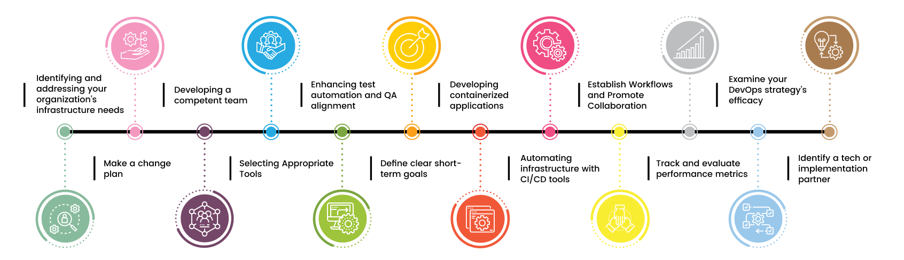

# No DevOps Anecdote this time! Yaay 🥳

# BUT Lets talk about characteritics of companies that are generally successful in adopting DevOps 

- **Understand the business value of what you are working on**
- **Fail fast, and piviot quickly when necessary**

- **Everything as code**
    - Infrastructure 
    - Pipeline 
    - Configuration 
    - Document 
  
- **Automate everything**
    - Infrastructure 
    - Deployments 
    - Testing 
    - Releases 
  
- **Security first approach**
    - Static application security testing (SAST)
    - Dynamic applicatin security testing (DAST)
    - Clean as you code
  
- **Monitor everything**
    - Infrastructure 
    - Application  
    - Pipeline 
    - performance 
  
- **Distinguish between release and deployments**
  
- **Create collaborative culture**
    - Lunch and Learns
    - Communities of practice

- **Emphasize customer satisfaction and gather feedback**

## Remember, DevOps is a journey and NOT destination
