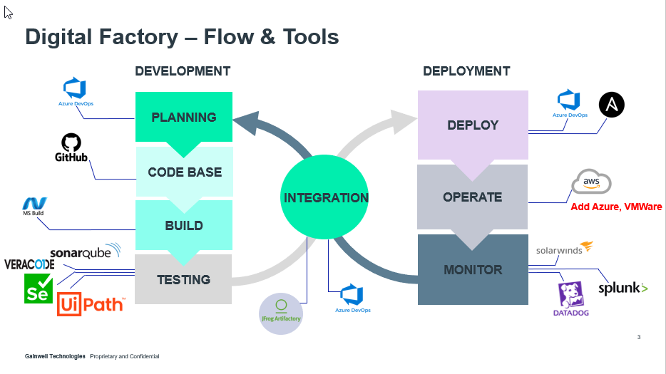

# BAT 4 final demo

## Digital Factory and scale

### Team introductions

### - What is Digital Factory?
### - Challenges
  - Many tools and processes
  - Multiple handoffs
  - Automation silos causing repeat work

### - What did we do at Buildathon 4 for Digital Factory?
  - Create reusable code
  - Enabled features in tool to streamline developer experience
  - Worked on getting closer to making automation whole

## -***-Demo From Jeremy-***-

## Community of practice (CoP)

- What is a CoP?
- What's in it for me?
- Fine, I get the idea, How do I become a member?

[Anisble Community of Practice at Gainwell](https://mygainwell.github.io/Ansible-CoP/)
## App pre-req scripts

### - Approach
  - Make playbooks declarative
  - Identify all items that are needed for app installs to run without hiccup

### - Accomplishments
  - Automatic service accounts (in BT only, discussion to be furthered with security)
  - Automatic SQL Grants
  
## -***- Demo from Ujit, Mike and SriHari -***-
